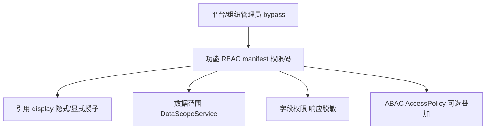

# 权限职责划分（唯一控制栈）

本文档定义 RiverEdge **允许的**权限控制层，以及已从栈中移除/禁止的旁路。与 [permission-contract.md](./permission-contract.md) 配套。

## 控制栈（自上而下）



| 层 | 唯一入口 | 回答的问题 |
|----|----------|------------|
| **管理员 bypass** | `UserPermissionService.is_admin_bypass` / `AccessControlService` 平台&组织管理员 | 租户管理员、平台管理员、系统管理员角色全量能力 |
| **功能 RBAC** | `require_permission_codes` / 应用 `*_route_access` → `ensure_permission_codes` | 能否打开页面、执行 create/update/audit/print 等 |
| **引用 display** | `check_reference_display` + `/core/reference/display-*` | 无管理页 read 时，能否在业务单据下拉/回显 |
| **数据范围** | `DataScopeService.apply` / `row_visible` | 能看见哪些行（与 RBAC 正交） |
| **字段权限** | `PermissionPolicyService.apply_field_masks_to_dict` | 响应中金额/客户名等字段脱敏 |
| **ABAC** | `AccessControlService._evaluate_policies`（默认对细粒度路由 `check_abac=False`） | 策略级允许/拒绝 |

## 管理员 bypass 契约（三路径合一）

以下身份在 **功能 RBAC** 与 **数据范围** 层等效为全量：

1. `user.is_infra_admin` / 平台超级管理员
2. `user.is_tenant_admin`
3. 角色 code ∈ `{ADMIN, SYSTEM_ADMIN, SUPER_ADMIN}` 或 name = `系统管理员` → `UserPermissionService.get_user_permissions` 合并租户全部权限码

**禁止**在业务 service 内再写第四套 admin 判断；统一使用 `UserPermissionService.is_admin_bypass(user, tenant_id)`。

## 不属于权限栈（保留但不得门控 RBAC）

| 机制 | 用途 | 禁止 |
|------|------|------|
| 外协身份 `role_type=external` + `external_partner_type` | 数据范围附加 Q 过滤、UI 文案 | 代替 manifest 的 create/update/read |
| 单据状态机 `assert_sheet_mutation_allowed` | 业务状态 | 代替 audit/submit 权限码 |
| 「我的单据」`applicant_user_id=me` | 列表筛选 UX | 代替模块 read |
| 客户池 claim/release/assign | 所有权变更业务规则 | 代替 visibility（visibility 归 DataScope） |

## 已清理 / 禁止的 competing 控制源

| 原旁路 | 处理 |
|--------|------|
| 客户 list `is_regular_user` + salesman/pool 手写 Q | 迁入 `DataScopeService` + `customer_salesman_pool` 默认解析器 |
| 跟进/商机 list `is_regular_user` + `_allowed_customer_ids` | 迁入 `DataScopeService` + `customer_owned_via_customer_id` |
| 采购 list `buyer_id=me` 手写 Q | 改用 `DataScopeService`（`kuaizhizao:purchase-order` profile） |
| 数据字典 / 部门 / 自定义字段 API 仅 tenant | 补齐 `system:*` RBAC（`system_module_access.py`） |
| 数据字典 `GET /code/{code}` 仅 read | 放宽为 `read` 或 `display`（枚举回显） |
| `associated-options` 裸 ORM 查全表 | 已映射表走 `ReferenceDisplayService` + DataScope |
| `assert_trial_external_operator` 死代码 | 已删除 |
| HaoliGO `_haoligo_route_access` 回落 URL 推断 | 已禁止（注释契约） |
| kuaizhizao `_kuaizhizao_route_access` 回落 URL 推断 | 已改为显式 path→action（与 HaoliGO 同构） |
| kuaizhizao API 仍用 core `require_module_access` | 已迁 `require_kuaizhizao_module_access`（14 个路由模块） |
| master_data API 仍用 core `require_module_access` | 已迁 `require_master_data_module_access`；factory 补齐 RBAC |
| kuaicaiwu cost 模块仍用 core `require_module_access` | 已迁 `require_kuaicaiwu_module_access` |
| kuaicaiwu finance `require_access("finance.*")` | 已迁 `require_permission_codes`（receipt/payment/sales-invoice 等 manifest 码） |
| kuaicaiwu 后端 manifest 权限不完整（sales/purchase-invoice 等仅 read） | 已补齐全模块 STANDARD_ACTIONS；API 与 manifest 模块码一一对应 |
| master_data `performance.py` 无 RBAC / 混用 `require_access` | 已接 `require_performance_module_access`（权限归属 kuaizhizao manifest） |
| `mobile_workbench._admin_bypass` 第四套 admin | 收敛至 `UserPermissionService.is_admin_bypass` |
| 前端 kuaizhizao 质量模块直接 `hasPermission` | 已迁 `useResourcePermissions` / `hasModulePermission` |
| 报价/销售订单 workflow 按钮仅状态门控 | 已补 submit/review/revoke RBAC（含 `UniWorkflowActions.resourcePrefix`） |
| `filterByPermission` 未知 action 默认放行 | 已改为 fail-closed |
| 选择器直接 list API + 静默空数组 | 已迁移 reference display + 明确 403 提示 |
| 客户池 list `is_regular_user` scope 分支 | 迁入 `DataScopeService`（`customer_salesman_pool`） |
| `associated-options` 裸 ORM 遗留路径 | 未映射表 422；主数据/核心单据已注册 provider |
| `DataScopeService._admin_bypass` 缺 ADMIN 角色 | 统一委托 `UserPermissionService.is_admin_bypass` |
| `AccessControlService` / `has_any_permission` 仅平台&组织管理员 bypass | 收敛至 `is_admin_bypass` / `is_admin_bypass_flags`（含 ADMIN 角色） |
| `require_permissions` 废弃 shim | 已删除（无调用方） |
| `apps_kuaizhizao_*` 未映射 `TABLE_REFERENCE_RESOURCE` | 已全部注册 reference_resources + provider |
| `apps_master_data_engineering_drawings` 未映射 | 已注册 `master-data:process:drawing` |

## 开发自检

```bash
cd riveredge-backend && python scripts/scan_permission_bypass.py --fail-on high
```

新增行级过滤 **必须** 注册 `DataScopeResourceProfile`，禁止在 service 内对 `is_regular_user()` 手写 Q。
