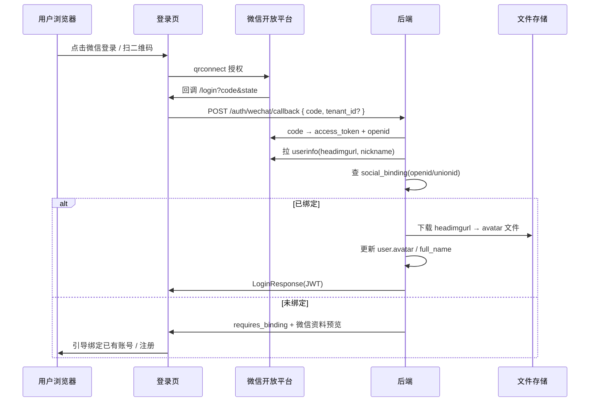

# 微信扫码登录改造方案

> 基于 RiverEdge 现有代码结构整理，适用于登录页支持微信扫码登录，并将微信头像同步为系统用户头像。

---

## 一、现状盘点

| 模块 | 状态 | 说明 |
|------|------|------|
| 登录页微信按钮、跳转 `qrconnect`、回调处理 | ✅ 已有 | `riveredge-frontend/src/pages/login/index.tsx` |
| 调用 `POST /auth/wechat/callback` | ✅ 前端已有 | `riveredge-frontend/src/services/publicAuth.ts` |
| 后端 `/auth/wechat/callback` | ❌ 未实现 | `riveredge-backend/src/infra/api/auth/auth.py` 中无对应路由 |
| 用户头像存储 | 文件 UUID | `User.avatar` 关联文件管理，非外链 URL |
| openid / unionid 绑定表 | ❌ 没有 | 需新建社交账号绑定表 |

### 当前前端流程（已实现）

```
点击微信 → 跳转 open.weixin.qq.com 扫码
→ 回到 /login?provider=wechat&code=xxx&state=xxx
→ wechatLoginCallback(code) → 后端（缺失）→ JWT
```

**结论：** 前端骨架已具备，需补齐 **后端 OAuth + 账号绑定 + 头像入库**；前端可进一步优化为页内嵌二维码。

### 关键代码路径

| 用途 | 路径 |
|------|------|
| 登录页微信逻辑 | `riveredge-frontend/src/pages/login/index.tsx` |
| 前端回调 API | `riveredge-frontend/src/services/publicAuth.ts` |
| 需新增的后端路由 | `riveredge-backend/src/infra/api/auth/auth.py` |
| 用户模型 | `riveredge-backend/src/infra/models/user.py` |
| 头像上传参考 | `riveredge-frontend/src/pages/personal/profile/index.tsx` |
| 文件服务 | `riveredge-backend/src/core/services/file/file_service.py` |
| 头像工具 | `riveredge-frontend/src/utils/avatar.ts` |

---

## 二、微信开放平台准备（必做）

1. 在 [微信开放平台](https://open.weixin.qq.com/) 创建 **网站应用**（非公众号、非小程序）。
2. 获取 **AppID / AppSecret**（Secret **仅放后端**）。
3. 配置 **授权回调域**（如 `yourdomain.com`）。
4. 网站应用扫码登录相关接口：
   - 授权页：`https://open.weixin.qq.com/connect/qrconnect`
   - scope：`snsapi_login`
   - 用 `code` 换 `access_token`，再拉用户信息（含 `nickname`、`headimgurl`、`openid`、`unionid`）。

> **注意：** `unionid` 需开放平台与公众号/小程序绑在同一主体；若无 unionid，先用 `openid` 绑定。

---

## 三、推荐整体架构



---

## 四、后端改造（核心）

### 4.1 新增社交账号绑定表

建议新建 `infra_user_social_bindings`（或类似命名）：

```text
id
tenant_id
user_id
provider          -- 'wechat'
openid            -- 必填
unionid           -- 可选，有则优先用 unionid 查
nickname          -- 微信侧快照（可选）
avatar_url        -- 微信侧头像 URL 快照（可选）
created_at
updated_at

UNIQUE(provider, openid)  或  UNIQUE(provider, unionid)
```

没有此表，微信登录无法稳定对应到系统用户。

### 4.2 新增 WechatOAuthService

职责：

1. `exchange_code(code)` → `{ access_token, openid, unionid }`
2. `fetch_userinfo(access_token, openid)` → `{ nickname, headimgurl, ... }`
3. AppID / AppSecret 从**平台配置或集成配置**读取，不写死在代码中。

**配置建议：**

- 平台级：`infra_settings` 或集成配置 `wechat_oauth`（`app_id`, `app_secret`, `redirect_uri`）
- **AppSecret 绝不能放到 `VITE_WECHAT_APPID` 等前端环境变量**

**微信 API 参考：**

| 步骤 | 接口 |
|------|------|
| 用 code 换 token | `GET https://api.weixin.qq.com/sns/oauth2/access_token` |
| 拉用户信息 | `GET https://api.weixin.qq.com/sns/userinfo` |

### 4.3 实现 `POST /auth/wechat/callback`

```python
# 伪代码
async def wechat_callback(code: str, tenant_id: int | None):
    wx = await wechat_service.exchange_and_profile(code)
    user = await find_user_by_unionid_or_openid(wx.unionid, wx.openid, tenant_id)

    if not user:
        return {
            "requires_binding": True,
            "wechat_profile": {
                "nickname": wx.nickname,
                "headimgurl": wx.headimgurl,
                "openid": wx.openid,
            },
            "bind_token": "短期一次性 token",  # 用于后续绑定
        }

    avatar_uuid = await avatar_service.sync_wechat_avatar(
        tenant_id=user.tenant_id,
        user_id=user.id,
        headimgurl=wx.headimgurl,
        only_if_empty=True,  # 或每次登录都更新
    )
    if avatar_uuid:
        user.avatar = avatar_uuid
        await user.save()

    return await auth_service.generate_login_result(user, request)
```

**登录策略（需产品确认）：**

| 策略 | 说明 |
|------|------|
| A. 仅绑定已有账号 | 企业场景常见；未绑定返回 `requires_binding`，用户先用手机号/密码登录再绑定 |
| B. 自动注册 | openid 不存在则创建用户（需默认角色、组织归属规则） |
| C. 多组织 | 回调携带 `tenant_id`，或在绑定阶段选择组织 |

### 4.4 微信头像 → 系统头像

系统 `User.avatar` 为**文件 UUID**（见 `personal/profile` 上传逻辑），正确做法：

1. 后端用 `httpx` 下载 `headimgurl`（URL 末尾 `132` 可改为 `0` 获取大图）。
2. 写入租户文件目录，调用 `FileService.create_file(..., category='avatar')`。
3. 将返回的 `file.uuid` 写入 `user.avatar`。
4. 登录响应 / `/auth/me` 带上 `avatar`，顶栏通过 `getAvatarUrl` 显示。

**注意：**

- 微信头像 URL **会过期**，不要长期只存 URL，应落库为文件。
- 建议策略：**用户未设置头像时自动同步**；已有自定义头像则不覆盖（可在个人资料提供「使用微信头像」按钮）。

可抽取服务方法：

```python
async def sync_wechat_avatar(
    tenant_id: int,
    user_id: int,
    headimgurl: str,
    only_if_empty: bool = True,
) -> str | None:
    ...
```

### 4.5 可选：账号绑定接口

未绑定用户完成密码登录后，或注册完成后：

```
POST /auth/wechat/bind
Body: { bind_token, username?, password? } 或 { bind_token }（已登录用户）
```

---

## 五、前端改造

### 5.1 方案 A：沿用整页跳转（改动最小）

当前 `login/index.tsx` 已实现：

1. 配置 `VITE_WECHAT_APPID`（仅 AppID，可公开）。
2. 后端实现 `/auth/wechat/callback`。
3. `handleLoginSuccess` 已处理 `user.avatar`，确保 LoginResponse 返回 `avatar` 字段。

**现有关键逻辑：**

- 跳转：`https://open.weixin.qq.com/connect/qrconnect?appid=...&scope=snsapi_login&...`
- 回调：`/login?provider=wechat&code=...&state=...`
- CSRF：`sessionStorage.wechat_login_state` 校验

### 5.2 方案 B：登录页内嵌二维码（体验更好）

在登录页弹层内使用微信官方 `wxLogin.js`：

```tsx
// 登录页弹层内
<div id="wechat-login-qr" />

// 动态加载 wxLogin.js 后
new WxLogin({
  self_redirect: false,
  id: 'wechat-login-qr',
  appid: WECHAT_APPID,
  scope: 'snsapi_login',
  redirect_uri: encodeURIComponent(`${window.location.origin}/login?provider=wechat`),
  state: randomState,
  style: 'black',
});
```

回调处理仍走现有 `useEffect` 中对 `code/state` 的逻辑，**后端不变**。

### 5.3 未绑定账号 UI

`wechatLoginCallback` 若返回 `requires_binding`：

- 展示微信昵称 / 头像预览；
- 引导「绑定已有账号」（用户名密码 + `bind_token`）或「注册并绑定」；
- 调用 `POST /auth/wechat/bind`。

---

## 六、配置与安全清单

| 项 | 说明 |
|----|------|
| AppSecret | 仅后端环境变量 / 集成配置 |
| AppID | 前端可公开（WxLogin / qrconnect） |
| `state` | 已有 sessionStorage 校验，保留 |
| `redirect_uri` | 前后端必须一致，并在微信后台备案 |
| 回调限流 | 防止 code 暴力尝试 |
| 绑定防冒用 | `bind_token` 短期有效、一次性 |
| HTTPS | 生产环境必须 |

### 环境变量（前端）

```env
# riveredge-frontend/.env
VITE_WECHAT_APPID=wxXXXXXXXXXXXXXXXX
```

### 环境变量（后端，示例）

```env
# riveredge-backend/.env
WECHAT_OPEN_APP_ID=wxXXXXXXXXXXXXXXXX
WECHAT_OPEN_APP_SECRET=xxxxxxxxxxxxxxxxxxxxxxxxxxxxxxxx
WECHAT_OAUTH_REDIRECT_URI=https://yourdomain.com/login?provider=wechat
```

---

## 七、建议实施顺序

| 阶段 | 内容 |
|------|------|
| **第一期** | 绑定表 + `WechatOAuthService` + `/auth/wechat/callback` + 头像同步；**仅已绑定用户可登录** |
| **第二期** | 页内 WxLogin 二维码 + 未绑定引导绑定/注册流程 |
| **第三期** | 个人资料页「绑定微信 / 同步微信头像」 |

---

## 八、待产品确认项

1. 未绑定微信时：**自动注册** vs **必须绑定已有账号**？
2. 多组织用户：回调时是否必须选 `tenant_id`？
3. 头像策略：每次微信登录更新 vs 仅首次 / 空头像时更新？
4. AppID/Secret 存放：**平台设置** vs **集成配置中心**（`wechat_oauth`）？

---

## 九、相关文档

- [微信开放平台 - 网站应用微信登录](https://developers.weixin.qq.com/doc/oplatform/Website_App/WeChat_Login/Wechat_Login.html)
- 项目内集成配置占位：`wechat_oauth`（见 `pages.system.integrationConfigs.codePlaceholder`）

---

*文档版本：2026-05-23*
