# 快格云制造 · 线束行业数字化解决方案

> **版本**：V1.0  
> **适用产品**：快格云制造（基于 RiverEdge 多租户 SaaS 平台）  
> **文档性质**：行业解决方案书  
> **演示环境**：https://kuaigeyun.com  

> **Mermaid 导出说明**：下文流程图均采用纵向布局（`flowchart TB` / `TD`），节点文案已精简，便于 [Mermaid Live Editor](https://mermaid.live) 或 Typora 导出 PNG/SVG 后插入 Word。转 Word 时请勿直接粘贴 Mermaid 源码，应先渲染为图片。

---

## 目录

1. [方案摘要](#1-方案摘要)
2. [线束行业现状与痛点](#2-线束行业现状与痛点)
3. [方案定位与价值主张](#3-方案定位与价值主张)
4. [总体架构](#4-总体架构)
5. [线束行业专属能力](#5-线束行业专属能力)
6. [业务场景与流程设计](#6-业务场景与流程设计)
7. [功能模块分模块介绍](#7-功能模块分模块介绍)
8. [典型岗位应用](#8-典型岗位应用)
9. [实施路径与上线保障](#9-实施路径与上线保障)
10. [技术说明](#10-技术说明)
11. [演进规划](#11-演进规划)
12. [附录](#12-附录)

---

## 1. 方案摘要

**快格云制造**是面向 10–200 人离散制造企业的轻量级制造执行与经营管理系统（MES + 轻 ERP），基于 **RiverEdge** 多租户 SaaS 平台构建，支持按模块启用、极简与全流程两种运行模式。

针对**汽车线束、工控线束、家电线束、新能源线束**等细分场景，本方案在通用制造能力之上，预置**线束工艺工序库**、**线束常用辅材与紧固件标准件库**，并规划**线束增值包（kuaiwiring）**作为行业联合共创扩展，帮助企业用一套系统打通「订单—计划—生产—质量—仓储—交付—成本」全链路，替代 Excel 与纸质流转，缩短上线周期，支撑 MTO/MTS 并存、多品种小批量与按单追溯等核心诉求。

| 维度 | 说明 |
|------|------|
| **目标客户** | 线束加工厂、线束总成厂、为整车/整机配套的二级供应商 |
| **企业规模** | 约 10–200 人，1–5 条产线，年营收千万至数亿级 |
| **部署形态** | 多租户 SaaS，支持云端演示与私有化扩展 |
| **核心价值** | 轻量上线、需求驱动计划、线边倒冲减录入、全链路追溯、触屏报工 |

---

## 2. 线束行业现状与痛点

### 2.1 行业特征

线束制造属于典型的**离散装配型**生产，具有以下共性：

- **物料种类多**：导线、端子、连接器、热缩管、胶带、波纹管、扎带、护套等，规格参数（线径、颜色、长度、端子型号）组合繁杂。
- **BOM 与工艺强关联**：同一总成对应多张分支图/裁线表，工序链涵盖下线剥皮、压接、焊接、组装、包扎、电测、包装。
- **订单驱动明显**：汽车/工控客户以项目号、零件号、版本号管理，**按单生产（MTO）** 占比高；部分标准线束存在**备货生产（MTS）**。
- **质量门槛高**：压接拉力、剥皮尺寸、导通/耐压（HIPOT）等检验项与客户 PPAP/IATF 要求紧密相关。
- **来料形态多样**：自购原材料与客户指定料（**客供料**）并存，条码/批次追溯要求高。
- **委外环节常见**：部分工序（如特殊焊接、电镀件后道）委外加工，需与厂内工单协同。

### 2.2 管理痛点

| 痛点 | 典型表现 | 业务影响 |
|------|----------|----------|
| 计划与订单脱节 | 销售订单、试样单、预测分散在表格中，排产靠人工合并 | 交期延误、缺料停线 |
| 物料与版本混乱 | 图纸/BOM 变更未及时同步，旧版端子仍被领用 | 批量质量事故、客户索赔 |
| 现场数据采集难 | 压接、电测数据在纸质单或设备孤岛中 | 追溯困难、审核不通过 |
| 线边库存不清 | 裁线后线材、端子在线边堆积，账实不符 | 倒冲不准、成本失真 |
| 一人多岗 | 计划员兼仓库、品质兼报工统计 | 系统若太重则推不动 |
| 上线周期长 | 传统 MES/ERP 实施 6–12 个月，中小企业难以承受 | 数字化投入 ROI 低 |

---

## 3. 方案定位与价值主张

### 3.1 产品定位

快格云制造坚持**「轻量起步、按需扩展、需求驱动」**：

- **轻量起步**：先上线工单、报工、领料/入库、基础 BOM，即可替代纸质流转。
- **按需扩展**：销售、采购、质量、设备、财务、绩效等模块可按企业成熟度逐步开启。
- **需求驱动**：销售预测与销售订单统一为「需求」，一套 MRP/LRP 引擎自动区分 MTS/MTO，生成工单与采购建议。
- **面向中国工厂**：针对一人多岗、录入量大、快速上手优化交互（批量导入、一键下推、触屏报工）。

### 3.2 对线束企业的价值

| 价值维度 | 方案能力 | 预期收益 |
|----------|----------|----------|
| **交期可控** | 需求计算 → 生产计划 → 甘特排程 → 异常管理（缺料/交期） | 缩短订单承诺与执行偏差 |
| **质量可追溯** | 来料/过程/成品检验 + 全链路单据追溯 | 满足主机厂审厂与问题复盘 |
| **现场提效** | 工位触屏报工、扫码、线边仓 + 报工倒冲 | 减少重复录入与领料单 |
| **成本透明** | 成本核算、计件绩效、线边与仓库联动 | 支撑报价与毛利分析 |
| **快速上线** | 初始化向导、行业工序预设、标准件库、上线检查助手 | 数周内具备开单能力 |

---

## 4. 总体架构

### 4.1 平台架构

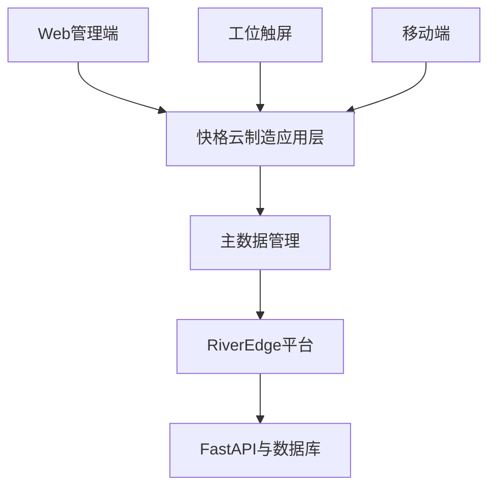

### 4.2 线束方案分层

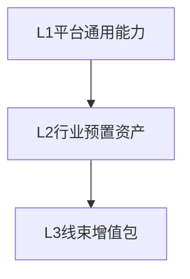

| 层级 | 内容 | 说明 |
|------|------|------|
| **L1 平台通用能力** | 快格云制造全模块 | 已上线，可直接用于线束企业 |
| **L2 行业预置资产** | 线束工艺预设、线束辅材/紧固件标准件 | 开箱即用，缩短主数据准备 |
| **L3 线束增值包** | kuaiwiring（规划中，联合共创） | 裁线表、电测对接、线束专项报表等深度能力 |

---

## 5. 线束行业专属能力

### 5.1 线束工艺工序预设

系统内置 **「线束与连接器」** 工艺模板（`wire_harness`），覆盖汽车/工控线束常见工序链，并预置各工序典型不良类型，便于快速建立工艺路线与检验项：

| 序号 | 工序 | 典型不良（预置示例） |
|------|------|----------------------|
| 10 | 下线剥皮 | 剥皮长度超差、芯线损伤、断铜丝 |
| 20 | 端子压接 | 拉力不足、喇叭口不良、压接高度超差 |
| 30 | 超声波焊接 | 焊接不牢、线芯变色、过焊损伤 |
| 40 | 线束组装 | 错装漏装、分支方向错误、卡扣断裂 |
| 50 | 缠胶带/包管 | 褶皱/起翘、间距不均、漏缠 |
| 60 | 导通/耐压测试 | 开路、短路、耐压击穿 |
| 70 | 检验包装 | 标签错误、混料、外观划伤 |

**线束典型工序链（流程）**

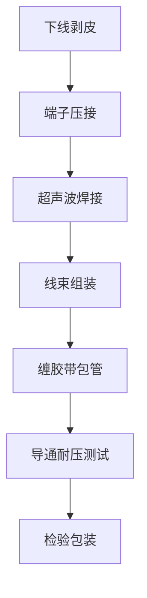

> 实施时可在「工序管理」中一键引用预设，再按企业实际设备与工位微调顺序、工时与检验计划。

### 5.2 线束标准件库

主数据模块提供 **行业 ID = wire_harness** 的标准件种子数据，支持快速导入常用物料：

**辅材-线束常用**（示例）

- PVC 电工胶带（19mm×20m）
- 阻燃波纹管（PA10）
- 尼龙扎带（4×200）
- 热缩标识管（Φ4.2）

**标准件-线束安装紧固件**（示例）

- 十字槽沉头螺钉、六角螺栓/螺母、平垫/弹簧垫圈
- P 型线夹（6mm）

物料可关联国标/行标编码字段，便于与采购、检验及客户物料码对齐。

### 5.3 线束增值包（kuaiwiring）

平台应用清单中已规划 **「线束增值包」**（应用代码：`kuaiwiring`），定位为基于快格制造的**线束行业专属能力包**，欢迎客户联合共创，预期方向包括（以实际发布为准）：

- 裁线表/分支 BOM 与工单联动
- 电测设备数据回传与不良自动关联
- 线束专项看板（工序 WIP、电测一次合格率、客诉追溯）
- 主机厂标签/ASN 发货模板扩展

---

## 6. 业务场景与流程设计

### 6.1 统一业务主线

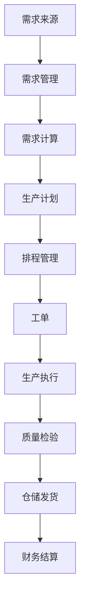

系统自动根据需求来源与关联关系区分 **MTO** 与 **MTS**，线束企业无需维护两套流程。

### 6.2 场景一：汽车/工控 MTO 按单生产

**适用**：客户 PO 驱动，一单一图，版本严格。

1. **销售**：录入销售订单（关联客户零件号、项目号）；新版本通过报价/订单变更管理。
2. **计划**：销售订单下推「需求」→ 需求计算展开 BOM（导线按长度、端子按件、辅材按套）。
3. **采购**：净需求生成采购申请/采购订单；客供料走「客户来料登记」，不入采购但纳入可用量。
4. **生产**：按工艺路线生成工单；下线/压接/组装工位触屏报工；电测工序登记合格/不良。
5. **质量**：来料检验（端子、连接器）；过程检验（压接首件）；成品检验（导通/耐压记录）。
6. **交付**：成品入库 → 发货通知 → 出库；全链路追溯从订单到批次。

**关键能力**：单据全生命周期可视化、向上/向下追溯、变更影响分析。

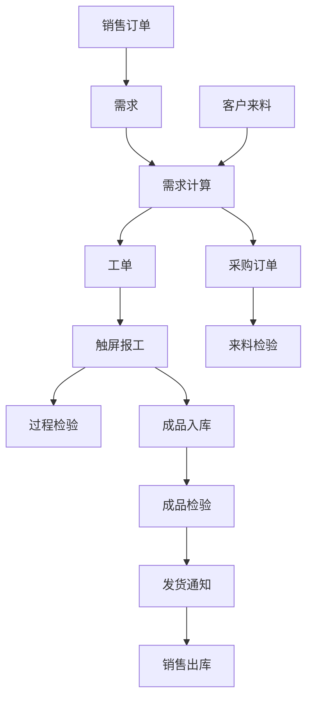

### 6.3 场景二：试样/打样快速响应

**适用**：新客户开发、工程样件、小批量验证。

1. **销售**：「试样打样」模块登记打样需求，关联物料与交期。
2. **计划**：打样需求纳入统一需求池，可单独计算或合并排产。
3. **仓储**：系统字典支持「试制/打样加料」等出库原因，区分量产领料。
4. **生产**：小批量工单 + 触屏报工，缩短流转路径。

**价值**：打样与量产数据同源，避免试样 BOM 散落表格。

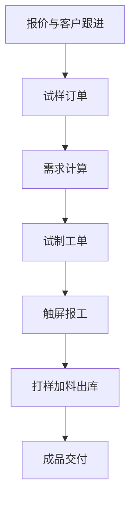

### 6.4 场景三：标准线束 MTS 备货

**适用**：高频标准件、经销商备货。

1. **销售**：销售预测维护备货型号与数量。
2. **计划**：预测 → 需求计算 → 批量工单/采购建议。
3. **仓储**：安全库存与补货建议；库存批次管理。

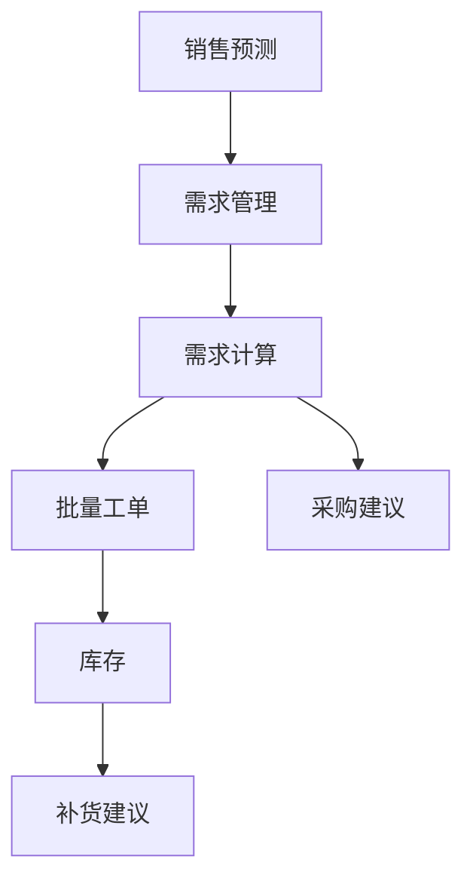

### 6.5 场景四：线边仓 + 报工倒冲

**适用**：裁线后线材、端子托盘存放产线旁，减少频繁仓库领料。

1. **仓储**：设立线边仓（关联车间/工作中心），从原材料仓调拨至线边。
2. **生产**：工序报工完成时，按 BOM **自动倒冲**线边库存。
3. **记录**：倒冲记录可追溯至工单与工序。

**价值**：契合线束「多频次、小批量领用」现场习惯，降低仓管与统计负担。

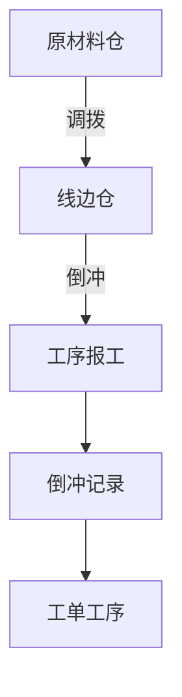

### 6.6 场景五：工序委外

**适用**：超声波焊接、特殊后处理等委外。

1. **生产**：创建委外单/委外工单，关联厂内工序。
2. **采购/仓储**：委外发料、委外到货与检验衔接。
3. **计划**：委外交期纳入异常管理（交期风险）。

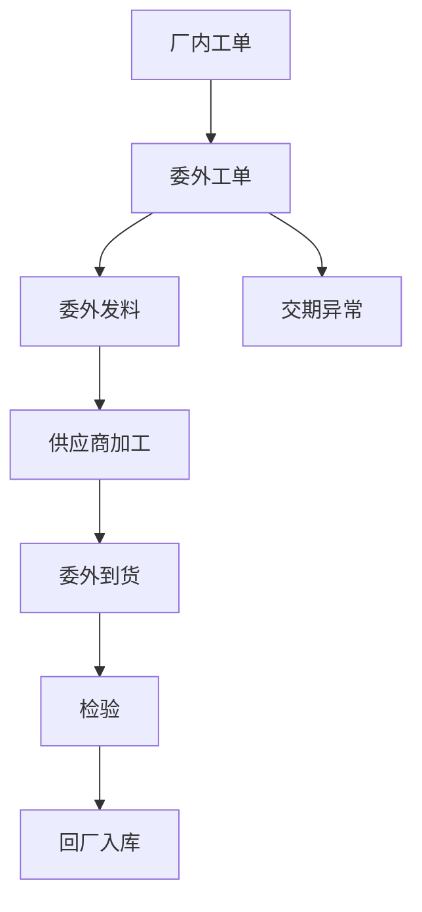

### 6.7 场景六：客供料管理

**适用**：主机厂指定导线、连接器到货。

1. **仓储**：「客户来料登记」登记批次、条码与客户订单关联。
2. **计划**：需求计算将客供料计入可用供给。
3. **追溯**：出货时可追溯至客供批次。

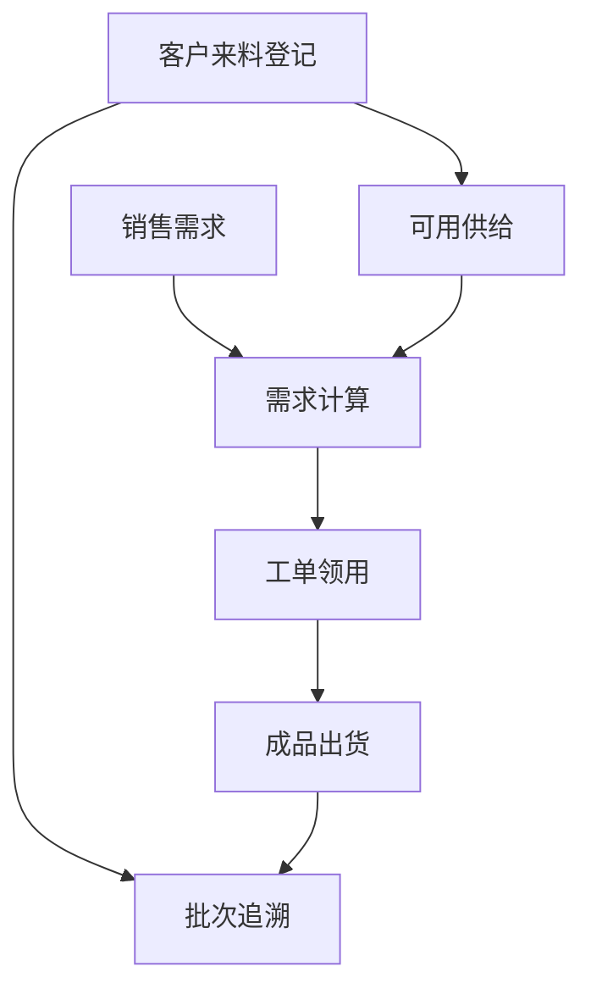

---

## 7. 功能模块分模块介绍

本章按线束企业数字化建设所需的功能模块逐一说明：**模块解决什么问题、包含哪些子功能、在线束场景下如何用、建议何时启用、与上下游如何衔接**。模块可按企业成熟度分阶段开启，不必一次全上。

### 7.0 模块总览与启用建议

| 序号 | 模块 | 线束核心价值 | 建议阶段 |
|------|------|--------------|----------|
| 1 | [主数据管理](#71-主数据管理) | 物料/BOM/工艺/工厂建模，数字化底座 | **P1 必须** |
| 2 | [生产执行](#75-生产执行) | 工单、触屏报工、委外、现场异常 | **P1 必须** |
| 3 | [仓储管理](#78-仓储管理) | 线边仓、倒冲、客供料、批次追溯 | **P1 必须** |
| 4 | [销售管理](#72-销售管理) | 订单、报价、发货、客户项目跟踪 | P1–P2 |
| 5 | [计划管理](#73-计划管理) | 需求计算、排产、缺料预警 | P2 |
| 6 | [采购管理](#74-采购管理) | 导线端子采购、委外到货 | P2 |
| 7 | [质量管理](#76-质量管理) | 来料/过程/成品检验、追溯 | P2（审厂企业 P1） |
| 8 | [设备与工装](#77-设备与工装管理) | 压接机、模具、工装保养 | P3 |
| 9 | [绩效管理](#711-绩效管理) | 工序计件、压接/组装绩效 | P2–P3 |
| 10 | [分析、报表与成本](#79-分析报表与成本) | 单据效率、成本、经营看板 | P2–P3 |
| 11 | [财务管理](#710-财务管理快财务) | 应收应付、发票、结算 | P3 |
| 12 | [平台与扩展能力](#712-平台与扩展能力) | 审批、打印、编码、上线向导 | 全程 |
| 13 | [线束增值包](#713-线束增值包kuaiwiring) | 行业深度能力（联合共创） | 规划 |

---

### 7.1 主数据管理

**模块定位**  
企业制造数据的统一维护中心，为计划、生产、质量、仓储提供「单一数据源」。线束企业上线第一站，没有准确的主数据，后续 MRP、倒冲、追溯均无法可靠运行。

**线束行业为何需要**  
线束物料规格维度多（线径 AWG/mm²、颜色、长度、端子型号、防水等级），BOM 与裁线表、工艺路线强绑定；客户零件号、内部料号、供应商料号往往三套编码并存，必须在主数据中规范。

#### 子功能说明

| 子模块 | 功能要点 | 线束应用示例 |
|--------|----------|--------------|
| **工厂建模** | 厂区、车间、产线、工位、工作中心、工作小组 | 按「裁线线—压接线—组装线—电测站—包装线」建模；工位对应触屏报工点 |
| **仓库主数据** | 仓库、库区、库位 | 区分原材料仓、成品仓、**线边仓**（关联车间/工作中心） |
| **物料管理** | 物料档案、分组、来源类型（自制/采购/委外/虚拟件） | 导线（按米）、端子/连接器（按件）、胶带/波纹管（按卷/米）；维护提前期、安全库存 |
| **变体属性** | 规格维度扩展 | 线色、线径、护套材质等维度化描述 |
| **批次/序列号规则** | 批次规则、批次档案、序列号规则 | 铜材批次、客供连接器批次追溯 |
| **工艺管理** | 工序、工艺路线、工程 BOM、SOP、不良品项 | 引用 **「线束与连接器」** 工序预设；BOM 展开导线用量 |
| **供应链主数据** | 客户、供应商 | 主机厂客户、端子/导线供应商档案 |
| **线束标准件库** | 行业预置物料种子 | 一键导入辅材（胶带、波纹管、扎带、热缩管）及安装紧固件 |

#### 典型用法

1. 新建总成物料 → 维护工程 BOM（导线+端子+辅材）→ 绑定工艺路线（下线→压接→…→电测→包装）。
2. 工序档案引用 `wire_harness` 预设，并挂接不良类型（如压接「拉力不足」、电测「开路/短路」）。
3. 线边仓在仓库档案中标记类型为线边，并关联压接/组装车间。

#### 协同关系

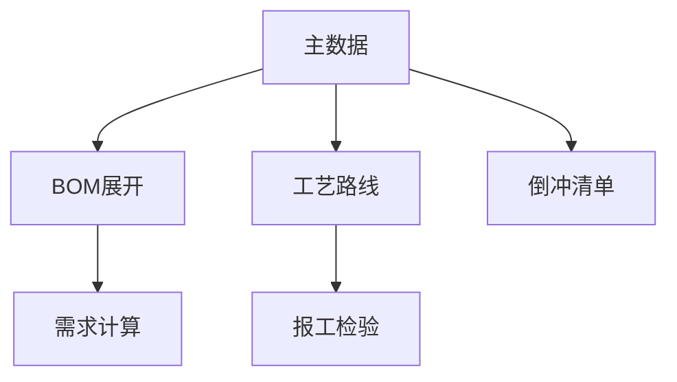

**启用建议**：第一期必须完成；至少导入 3–5 个代表型号的 BOM 与工艺路线后再开生产。

---

### 7.2 销售管理

**模块定位**  
管理从商机、报价到订单、发货通知的销售全流程，是 **MTO 线束厂** 的需求源头，与计划层「统一需求」直接衔接。

**线束行业为何需要**  
客户 PO 常带项目号、零件号、版本号；交货期紧、变更频繁；试制/量产订单并存，需在同一系统内区分并下推计划。

#### 子功能说明

| 子功能 | 功能要点 | 线束应用示例 |
|--------|----------|--------------|
| **报价单** | 询价、核价、版本管理 | 按 BOM 估算导线+端子+工时；报价转订单 |
| **客户跟进** | 跟进记录、待办、关联报价/订单 | 主机厂项目节点、图纸确认进度 |
| **销售预测** | 备货型号与数量预测 | 标准线束 **MTS** 备货依据 |
| **销售订单** | MTO/MTS 订单、明细、交期、审核 | 录入客户零件号；订单下推生成「需求」 |
| **发货通知** | 发货预告、与出库衔接 | 按客户 ASN/标签要求组织发货批次 |
| **销售退货** | 退货单、与库存/财务联动 | 客户现场退回线束处理 |
| **销售报表** | 订单执行跟踪、客户销售汇总、预测对比等 | 订单齐套率、交期达成分析 |

#### 打样/试制说明

线束新品开发频繁。系统通过 **报价单 + 客户跟进 + 小批量销售订单** 管理打样需求；生产侧以试制工单配合，仓储可使用「试制/打样加料」出库原因，与量产领料区分。打样 BOM 与量产 BOM 同源维护，避免表格散落。

#### 协同关系

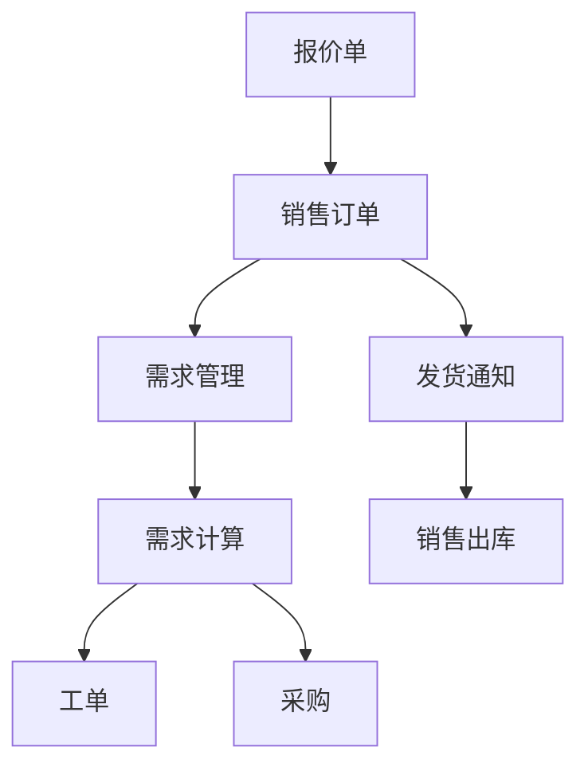

自定义字段可扩展：项目号、客户图号、ECN 变更号。

**启用建议**：有正式接单与交期管理需求时启用（P1 末或 P2 初）；纯来料加工可先录工单，后补销售模块。

---

### 7.3 计划管理

**模块定位**  
将销售预测、销售订单等需求统一为「需求」对象，经 **需求计算（MRP/LRP）** 展开 BOM、扣减库存，生成生产计划、工单建议与采购建议，是线束厂「算料、算交期」的核心。

**线束行业为何需要**  
同一时期多客户订单叠加，导线/端子缺料会导致全线停线；BOM 中导线按长度、端子按件，计算逻辑需准确；客供料须计入供给量。

#### 子功能说明

| 子功能 | 功能要点 | 线束应用示例 |
|--------|----------|--------------|
| **需求管理** | 需求录入、生命周期、来源追溯 | 区分订单需求、预测需求；合并多订单同型号 |
| **需求计算** | BOM 展开、库存扣减、净需求、一键生成工单/采购 | 自动计算 0.5mm² 导线米数、端子只数；识别缺料 |
| **生产计划** | 计划单人工调整、转工单 | 按产线负荷调整下线/压接计划 |
| **排程管理** | 工单级甘特排产 | 电测瓶颈工序排产；交期倒排 |
| **计算配置 / 历史** | MRP 参数、运算历史复盘 | 调整提前期、批量规则后重算 |
| **计划报表** | 缺料预警、产能负荷、计划达成率、延误分析 | 端子缺料清单、压接产能负荷 |

#### 协同关系

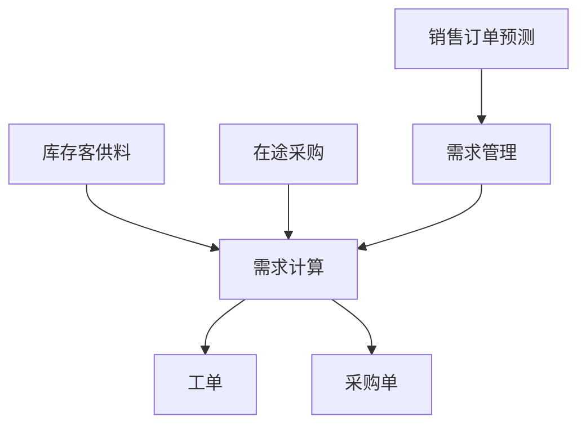

流程开关：可配置「工单直连需求计算」或「必经生产计划」。

**启用建议**：P2；若订单少、品种少，可暂用手工建工单，待订单量上升再开 MRP。

---

### 7.4 采购管理

**模块定位**  
管理自购物料的请购、采购、到货全过程，保障导线、端子、辅材供应；并与来料检验、仓储入库衔接。

**线束行业为何需要**  
原材料占比高，供应商交期与质量波动直接影响产线；部分企业需「采购申请审批」合规流程。

#### 子功能说明

| 子功能 | 功能要点 | 线束应用示例 |
|--------|----------|--------------|
| **采购申请** | 部门请购、审批、转采购订单 | 计划缺料自动生成申请；试制加料请购 |
| **采购订单** | 订单、明细、交期、供应商 | 铜线按卷/按米采购；端子按盘 |
| **到货通知** | 预告到货、收货准备 | 仓库提前安排检验与上架 |
| **采购退货** | 退货出库、供应商对账 | 来料不合格批次退回 |
| **采购报表** | 订单进度、供应商交期/质量/价格对比 | 端子供应商 OTIF 统计 |

#### 协同关系

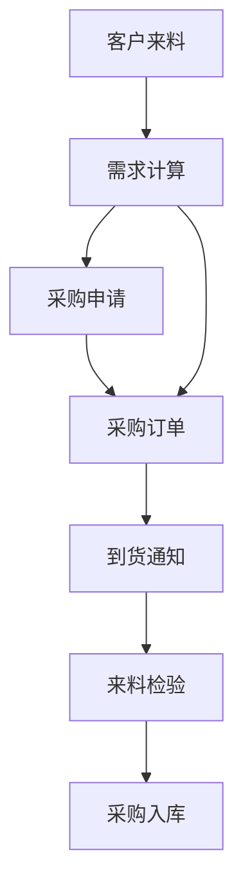

**启用建议**：自购料占比高的企业 P2 启用；流程开关支持「直采」简化路径。

---

### 7.5 生产执行

**模块定位**  
工单全生命周期管理：下达、派工、报工、完工、返工、委外及现场异常，是线束 **现场数字化** 的核心模块。

**线束行业为何需要**  
工序多、节拍差异大（裁线快、电测瓶颈）；需按工序采集产量与不良；触屏/扫码报工降低一人多岗录入负担。

#### 子功能说明

| 子功能 | 功能要点 | 线束应用示例 |
|--------|----------|--------------|
| **工单管理** | 创建、下达、暂停、完工、齐套检查 | 按销售订单/计划生成；关联工艺路线 |
| **报工** | 工序报工、合格/不良数量、工时 | 压接工序报工；记录不良「喇叭口不良」 |
| **工位触屏终端** | 大按钮、扫码、全屏、数字键盘 | 压接/组装工位扫码开工完工 |
| **返工单** | 返工路线、补料、再检验 | 电测不合格线束返修 |
| **委外管理** | 委外单、委外工单、发料与回货 | 超声波焊接委外 |
| **装箱绑定** | 箱码与批次/工单绑定 | 出货箱与客户标签对应 |
| **异常管理** | 缺料、交期、质量异常登记与处理 | 端子断供触发缺料异常 |
| **生产报表** | 工单跟踪、工序进度、WIP、报废分析、委外对账 | 电测工序 WIP、一次合格率 |

#### 协同关系

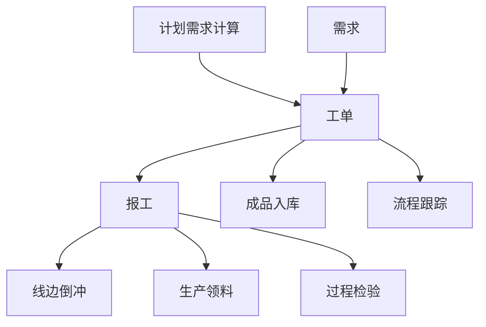

**启用建议**：**P1 必须**；可先上工单+触屏报工，委外与异常随后开启。

---

### 7.6 质量管理

**模块定位**  
贯穿来料、过程、成品的检验与质量追溯，支撑 IATF/客户审厂对检验记录与批次追溯的要求。

**线束行业为何需要**  
压接拉力、剥皮尺寸、导通/耐压为关键控制点；不良类型需与工序预设一致；客诉需快速追溯到工单、批次、检验记录。

#### 子功能说明

| 子功能 | 功能要点 | 线束应用示例 |
|--------|----------|--------------|
| **检验计划** | 按物料/工序配置检验项与频次 | 压接首件检验；电测全检 |
| **来料检验** | 原材料检验、判定、不合格处置 | 端子、连接器来料抽检 |
| **过程检验** | 工序中检验、首件/巡检 | 剥皮长度、压接高度抽检 |
| **成品检验** | 成品入库前检验 | 导通、耐压 HIPOT 记录 |
| **追溯管理** | 批次/条码正向与反向追溯 | 从成品查导线批次、压接工单 |
| **质量报表** | 合格率趋势、不良柏拉图、异常跟踪 | 开路/短路占比分析 |

#### 协同关系

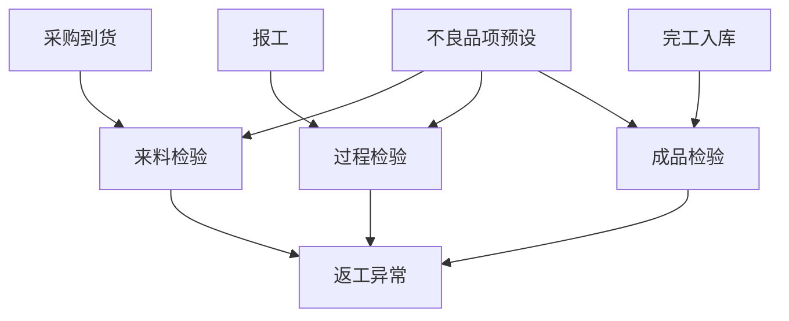

**启用建议**：主机厂配套企业 **P1–P2**；一般加工厂 P2 起；可先上来料+成品检验。

---

### 7.7 设备与工装管理

**模块定位**  
设备、模具、工装台账及故障、保养、状态管理，保障压接机等关键设备 OEE 与模具寿命可控。

**线束行业为何需要**  
全自动压接机、测线机投资大；模具（端子模具）需保养与校准；设备停机直接影响交期。

#### 子功能说明

| 子功能 | 功能要点 | 线束应用示例 |
|--------|----------|--------------|
| **设备台账** | 设备档案、所属产线/工位 | 压接机、裁线机、电测台 |
| **故障管理** | 故障报修、处理记录 | 压接压力异常停机 |
| **保养计划 / 提醒** | 定期保养、到期提醒 | 压接模具清洁保养周期 |
| **设备状态** | 运行/停机/维修状态看板 | 产线设备可用性 |
| **模具管理** | 模具台账、使用次数、校准 | 端子模具寿命管理 |
| **工装管理** | 工装台账、使用与维护 | 组装治具、定位板 |
| **设备报表** | 故障分析、保养明细、OEE | 压接线 OEE 统计 |

**启用建议**：P3；设备台数少时可先用台账+保养提醒，逐步完善。

---

### 7.8 仓储管理

**模块定位**  
入出库、库存、线边仓、倒冲、盘点、调拨、客供料等全流程库存管理，是线束 **物料流** 与 **成本核算** 的基础。

**线束行业为何需要**  
裁线后线材、端子托盘常放线边；报工倒冲可减少领料单；客供料与自购料需分账管理；出货需批次/箱码追溯。

#### 子功能说明

| 子功能 | 功能要点 | 线束应用示例 |
|--------|----------|--------------|
| **入库** | 采购入库、生产入库、其他入库 | 成品线束入库；余料退库 |
| **出库** | 销售出库、生产领料、其他出库 | 按发货通知出库 |
| **客户来料登记** | 客供批次、条码、关联订单 | 主机厂指定连接器到货 |
| **线边仓** | 线边库存查看、从主仓调拨 | 压接工序旁端子线边库 |
| **倒冲记录** | 报工自动扣减线边库存 | 组装报工扣减胶带、扎带 |
| **配料中心 / 叫料** | 集中配料、工单叫料 | 裁线批次配料 |
| **盘点 / 调拨** | 循环盘点、仓间调拨 | 线边与原材料仓对账 |
| **组装/拆解单** | 套件组装、拆解回库 | 预组装分线加工 |
| **库存 / 批次库存** | 现存量、批次查询、预警、补货建议 | 端子低于安全库存预警 |
| **条码映射规则** | 客户码与内部码映射 | 客户标签扫码出库 |
| **仓储报表** | 库存账、库龄、周转、出入库汇总 | 导线库龄分析 |

#### 协同关系

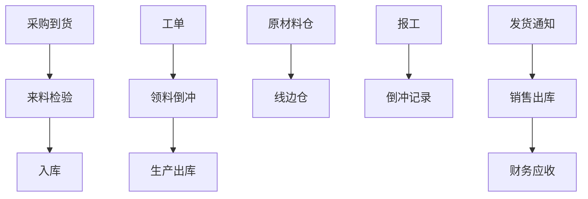

**启用建议**：**P1 必须**；优先原材料仓+线边仓+倒冲，再扩展盘点与批次精细化管理。

---

### 7.9 分析、报表与成本

**模块定位**  
从运营效率、单据时效、成本核算到自定义报表与 BI 看板，为管理层提供决策依据。能力分布在 **快制造内置分析**、**快报表（kuaireport）**、**快财务成本（kuaicaiwu）** 中。

**线束行业为何需要**  
需掌握订单执行周期、工序瓶颈、线束单品成本；客户审厂常抽查过程记录完整性。

#### 子功能说明

| 子功能 | 所属应用 | 线束应用示例 |
|--------|----------|--------------|
| **单据时效分析** | 快制造 / 快报表 | 从订单到工单、从工单到发货的周期 |
| **单据效率分析** | 快制造 / 快报表 | 各环节处理人效、停滞单据 |
| **全链路追溯视图** | 质量 + 生产 | 订单→工单→报工→检验→出库 |
| **各模块业务报表** | 快制造各模块 | 缺料、工序 WIP、合格率等（见 7.2–7.8） |
| **成本核算 / 规则 / 报表** | 快财务 | 按工单归集料工费；线束型号毛利 |
| **自定义报表 / BI 大屏** | 快报表 | 产线 OEE、电测一次合格率看板 |
| **经营看板** | 快财务 | 订单、出货、应收等综合指标 |

**启用建议**：P2 起使用内置报表；P3 配置成本规则与定制看板。

---

### 7.10 财务管理（快财务）

**模块定位**  
业务驱动的应收应付、收付款、发票与结算，与销售、采购、出入库单据联动，实现业务财务一体化。

**线束行业为何需要**  
客户账期与供应商账期管理；增值税发票；按订单核算回款与毛利。

#### 子功能说明

| 子功能 | 功能要点 | 线束应用示例 |
|--------|----------|--------------|
| **应收 / 收款** | 销售应收、收款核销 | 主机厂月结回款 |
| **应付 / 付款** | 采购应付、付款核销 | 铜材供应商付款 |
| **销项 / 进项发票** | 发票开具与登记 | 与订单、采购单关联 |
| **结算** | 对账、结算单 | 客户年度框架协议结算 |

**启用建议**：P3；业务单据稳定运行后再对接财务，避免双轨录入。

---

### 7.11 绩效管理

**模块定位**  
技能、计件/工时单价、员工配置与绩效汇总，支撑线束工序计件工资核算。

**线束行业为何需要**  
压接、组装等多为计件；电测、裁线可能计时+计件混合；需按工序统计人效。

#### 子功能说明

| 子功能 | 功能要点 | 线束应用示例 |
|--------|----------|--------------|
| **技能管理** | 员工技能与工序资质 | 高压线束须持证上岗 |
| **计件单价 / 工时单价** | 按工序定价 | 压接每件单价、裁线每根单价 |
| **员工配置** | 人员与班组、工作中心 | 压接班组人员 |
| **节假日** | 工作日历 | 加班工时计算 |
| **KPI 定义 / 绩效汇总** | 指标与月度汇总 | 人均产出、不良率挂钩 |
| **绩效报表** | 效率排名、计件工资汇总 | 压接工序工资明细 |

#### 协同关系

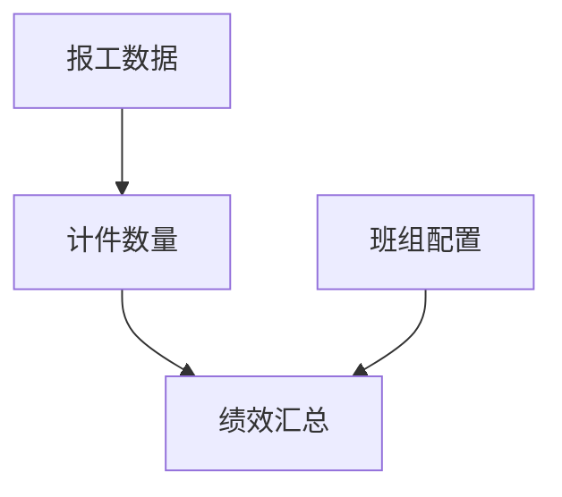

**启用建议**：有明确计件工资制度时 P2–P3 启用。

---

### 7.12 平台与扩展能力

**模块定位**  
RiverEdge 平台提供的租户、权限、流程配置与集成能力，保障线束方案可配置、可扩展、可快速上线。

| 能力 | 线束场景用途 |
|------|--------------|
| **初始化向导 / 上线检查助手** | 分角色检查主数据是否齐备 |
| **极简 / 全流程模式** | 先生产+仓储，后销售+计划+质量 |
| **流程开关** | 采购是否经申请、工单是否经计划 |
| **模块开关** | 按岗位隐藏无关菜单 |
| **编码规则** | 物料 WL、工单 GD、订单 XS 等统一编号 |
| **自定义字段** | 线色、线径、客户零件号、ECN |
| **审批流设计** | 订单变更、采购、报废审批 |
| **打印模板设计器** | 裁线卡、流转卡、发货标签、检验报告 |
| **嵌入式 Excel 导入** | 批量导入 BOM、物料、库存 |
| **外部数据 / 应用连接** | 预留电测机、标签打印机对接 |
| **二维码 / 装箱绑定** | 箱码追溯、工位扫码 |
| **移动端** | 现场查询、轻量审批与报工辅助 |
| **工位锁屏** | 触屏终端无人操作自动锁屏 |

---

### 7.13 线束增值包（kuaiwiring）

**模块定位**  
基于快格云制造的线束行业专属扩展包（应用代码 `kuaiwiring`），面向裁线表深度应用、电测设备互联、主机厂合规等场景，**欢迎客户联合共创**。

| 规划方向 | 说明 |
|----------|------|
| 裁线表 / 分支 BOM | 与工单、领料联动，减少 Excel 裁线表 |
| 电测数据回传 | 导通/耐压结果自动写入检验单 |
| 线束专项看板 | 工序 WIP、电测 FTY、客诉追溯 |
| 主机厂标签 / ASN | 发货标签与先进先出规则 |

> 当前以平台通用模块 + 线束工艺/标准件预置即可支撑主线业务；增值包按共创优先级迭代发布。

---

### 7.14 模块协同一览（线束 MTO 主线）

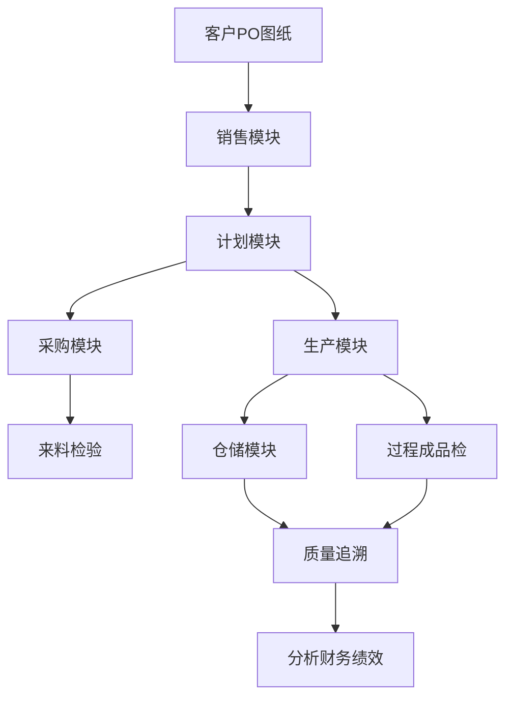

### 7.15 配置灵活性（速查）

| 配置项 | 线束企业常用设置 |
|--------|------------------|
| **运行模式** | 极简模式（先生产+仓储）→ 全流程模式 |
| **流程开关** | 采购是否经申请、工单是否经生产计划 |
| **模块开关** | 按岗位只开放必要菜单 |
| **编码规则** | 物料/工单/订单按客户码或内部码规则 |
| **自定义字段** | 线色、线径、客户零件号、工程变更号 |
| **审批流** | 订单变更、报废、特采等 |

---

## 8. 典型岗位应用

系统提供**分角色上线向导**，线束企业可按岗位推进培训与数据准备：

| 角色 | 主要职责 | 系统入口（示例） |
|------|----------|------------------|
| **销售** | 接单、报价、试样、发货跟踪 | 销售管理、销售业务向导 |
| **计划** | 需求计算、排产、缺料协调 | 计划管理、生产计划向导 |
| **工艺/技术** | BOM、工艺路线、SOP | 主数据-工艺、技术研发向导 |
| **采购** | 原材料、委外采购 | 采购管理、采购业务向导 |
| **仓库** | 收发存、线边调拨、客供料 | 仓储管理、仓储管理向导 |
| **班组长/操作工** | 报工、现场问题反馈 | 生产执行、触屏终端、生产操作向导 |
| **品质** | 检验、不良处置、追溯 | 质量管理、品质控制向导 |
| **设备** | 压接机保养、故障 | 设备管理、设备运维向导 |
| **管理层** | 交期、成本、绩效 | 分析中心、经营看板、管理决策向导 |

---

## 9. 实施路径与上线保障

### 9.1 推荐实施阶段

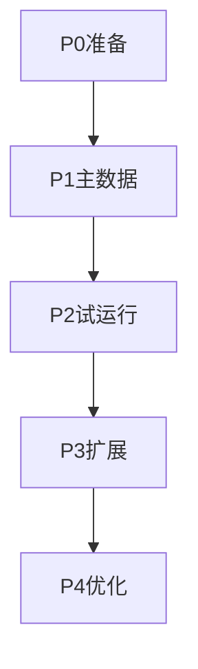

| 阶段 | 周期（参考） | 目标 | 主要工作 |
|------|--------------|------|----------|
| **P0 准备** | 1 周 | 环境就绪、组织对齐 | 租户开通、角色权限、编码规则 |
| **P1 主数据** | 1–2 周 | 可建工单 | 工厂建模、导入线束工序预设、物料/BOM、工艺路线 |
| **P2 试运行** | 2–3 周 | 小批量跑通 | 试单：订单→工单→报工→入库；线边仓试点 |
| **P3 扩展** | 2–4 周 | 计划+质量+采购 | 需求计算、检验计划、采购闭环 |
| **P4 优化** | 持续 | 数据驱动改善 | 成本、绩效、报表、kuaiwiring 共创 |

### 9.2 数据准备清单（线束）

- [ ] 厂区 / 车间 / 产线 / 工位（建议按：裁线—压接—组装—电测—包装划分）
- [ ] 线边仓与原材料仓
- [ ] 物料主数据（导线、端子、连接器、辅材）；可引用线束标准件库
- [ ] 典型产品 BOM（建议先 3–5 个代表型号）
- [ ] 工艺路线（引用「线束与连接器」预设后调整）
- [ ] 客户、供应商
- [ ] 检验计划（压接首件、电测全检等）

### 9.3 上线保障工具

| 工具 | 作用 |
|------|------|
| **初始化向导** | 极简/全流程模式、流程与模块开关 |
| **上线检查助手** | 分阶段检查主数据完整性 |
| **嵌入式 Excel 导入** | 批量导入物料、BOM、库存 |
| **业务蓝图配置** | 可视化配置业务流程 |
| **打印模板设计器** | 裁线卡、流转卡、发货标签 |
| **演示环境** | https://kuaigeyun.com 免注册体验 |

---

## 10. 技术说明

| 项目 | 说明 |
|------|------|
| **前端** | React 18 + TypeScript + Vite、Ant Design Pro；工位触屏大按钮界面 |
| **移动端** | Expo + React Native，支持现场查询与轻量操作 |
| **后端** | FastAPI、Tortoise ORM、PostgreSQL |
| **架构** | 多租户 SaaS、插件化应用、动态模块加载 |
| **集成扩展** | 外部数据连接、外部应用连接（预留电测设备、标签打印等对接） |
| **安全** | 租户隔离、角色权限、操作日志、工位锁屏 |

---

## 11. 演进规划

### 11.1 平台通用路线（已公开）

- 行业模板与智能默认值深化
- 有限能力排程、更精细产能约束
- 第三方系统集成、上下游协同
- 多级审批、流程可视化编排
- 报表设计器增强

### 11.2 线束专项路线

| 优先级 | 方向 | 说明 |
|--------|------|------|
| P0 | 工艺/标准件预置完善 | 持续补充线束物料分类与不良库 |
| P1 | kuaiwiring 增值包 MVP | 裁线表联动、电测数据接口 |
| P2 | 主机厂合规包 | PPAP 相关记录、标签与 ASN 模板 |
| P3 | 设备互联 | 压接/电测机台数据采集 |

欢迎线束企业与实施伙伴通过演示环境、官网或项目渠道参与 **kuaiwiring 联合共创**。

---

## 12. 附录

### 12.1 名词解释

| 术语 | 含义 |
|------|------|
| MTO | Make to Order，按订单生产 |
| MTS | Make to Stock，按库存/预测生产 |
| MRP/LRP | 物料/线束相关需求计划，系统统一为「需求计算」 |
| 线边仓 | 生产线旁暂存物料的仓库，支持报工倒冲 |
| 倒冲 | 报工时按 BOM 自动扣减线边库存，减少领料单 |
| 客供料 | 客户供应的原材料，通过来料登记管理 |

### 12.2 与竞品差异（简述）

| 对比维度 | 传统重型 MES/ERP | 快格云制造线束方案 |
|----------|------------------|---------------------|
| 上线周期 | 通常 6–12 个月 | 数周可试运行 |
| 功能范围 | 全模块捆绑 | 按需启用模块 |
| 行业适配 | 需大量定制 | 预置线束工序与标准件 + 增值包扩展 |
| 现场交互 | PC 为主 | 触屏报工 + 移动端 |
| 投入成本 | 高 | SaaS 轻量订阅模式 |

### 12.3 联系与演示

- **官网 / 演示**：https://kuaigeyun.com  
- **产品名称**：快格云制造  
- **平台**：RiverEdge SaaS  

---

*本文档依据快格云制造当前已上线能力与线束行业预置资产编写；kuaiwiring 等规划能力以产品实际发布为准。文档可随版本迭代更新。*
